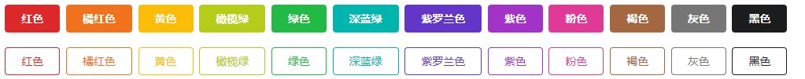
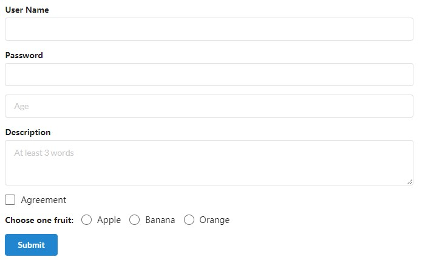
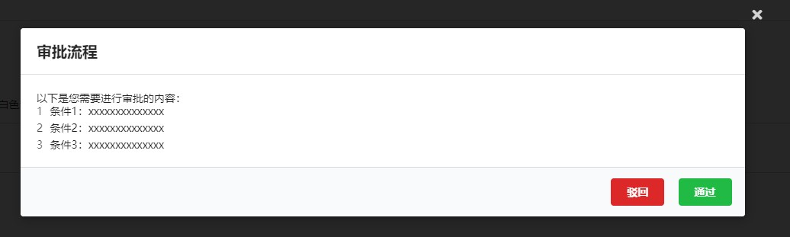
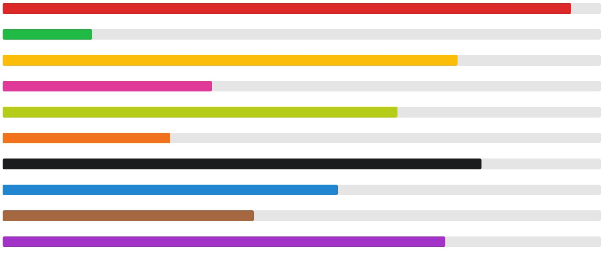
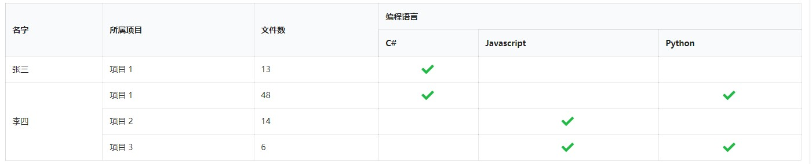
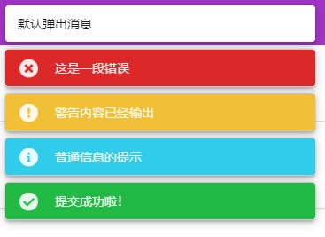

# Blamantic UI
可以自由组合的 UI 框架。

# 声明(Clarification)
> 项目大多数基础样式是在 **Semantic-UI(现由 [Formatic-UI](https://github.com/fomantic/Fomantic-UI) 维护)** 的 `semantic.css` 的基础上仅仅对组件进行封装，但有些交互设计在原作上是依赖于 JQuery 技术。
>
> 本作的宗旨是不依赖于 JQuery 技术实现交互效果，因此会有一个 `blamantic.css` 用于重写某些样式，并在组件中进行控制，从而对原有交互效果进行复现。*

# 快速开始
* `Install-Package BlamanticUI`
* 引入 `_content/BlamanticUI/blamantic.min.css` 样式
* 在 `_Import.razor` 中 `using BlamanticUI`
* 添加 `AddBlamanticUI` 服务

查看 demo 文件夹，Client 基于 WebAssembly，Server 基于 ServerSide，通过 VS 选择运行。

> 要求 .NET Core 5.0

# DEMO

## Button

## Calendar

## Form

## Modal

## Pagination

## Progress Bar

## Steps

## Table

## Toast Message

