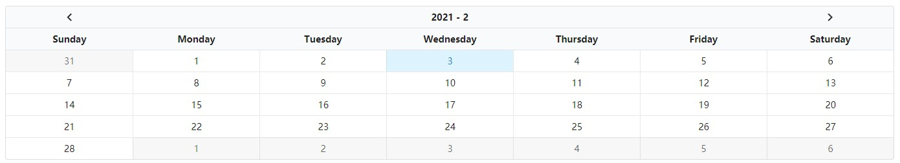

# Blamantic UI

The Semantic-UI for Blazor without jQuery.

# Quick Start

* `Install-Package BlamanticUI`
* Import css `_content/BlamanticUI/blamantic.min.css`
* Using namespace `using BlamanticUI`
* Add service `AddBlamanticUI`

> Required .NET Core 5.0

Check **demo** Directory, **Client** base on WebAssembly, **Server** base on ServerSide, Run in VS.

# Changes

# DEMO

## Button

## Calendar

## Form

## Modal

## Pagination

## Progress Bar

## Steps

## Table

## Toaster

## Accordion

## Label

## Item List

