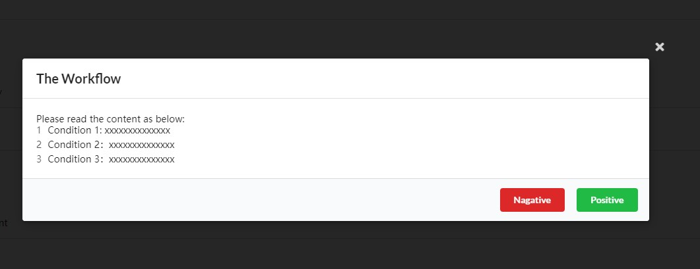
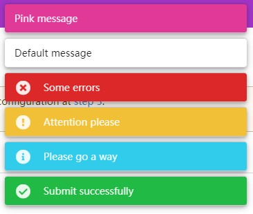

# Blamantic UI

The css framework from Semantic-UI for blazor without jQuery.

# Quick Start

* `Install-Package BlamanticUI`
* Import css `_content/BlamanticUI/blamantic.min.css`
* Using namespace `using BlamanticUI`
* Add service `AddBlamanticUI`

> Required .NET Core 5.0

* Check **demo** Directory
* **Client** base on WebAssembly, **Server** base on ServerSide
* Run in **Visual Studio 2019 v16.8+**.

# Notes

All changes please see [Changelog.md](Changelog.md)

For contributors please see [Contributing](CONTRIBUTING.md)

We are using [MIT licence](Licence.md)

The main css comes from [Fomantic-UI](), we override some code for compatibility in `Blamantic.css` and compiled from `Blamantic.scss`

# DEMO

## Button

## Calendar

## Form

## Modal

## Pagination

## Progress Bar

## Steps

## Table

## Toaster

## Accordion

## Label

## Item List

